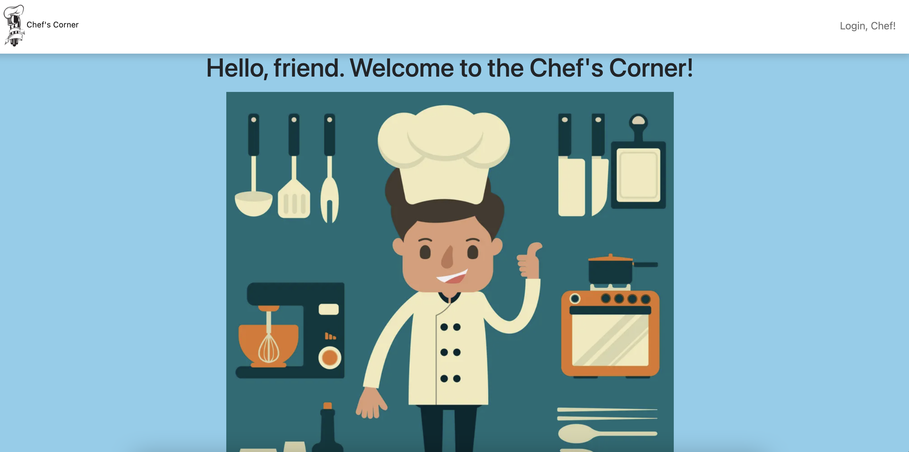

Title: Chef's Corner (Project Food Book)

Getting Started: https://project-food-book.herokuapp.com/

Instructions: Login using your Google account, and start adding recipes to your cookbook! You can add notes, and identify recipe preparation difficulty with an easy-to-read drop down menu named for some of the best chefs in the world.

Stack used: Full-Stack; MEN (MongoDB, ExpressJS, Node.js)
Additional technologies: HTML, CSS, Mongoose, Google Cloud, Google OAuth, Passport

Next Steps:
1. Enable users to add images of user-created recipes.
2. Pre-populate database by exposure to Tasty API.
3. Enable users to create a friend list based on shared interest in recipes, only visible once they have added a recipe to their favorites.
4. Enable a chat room function for sharing and discussing your favorite recipes.
5. Enable a message board and comment system.